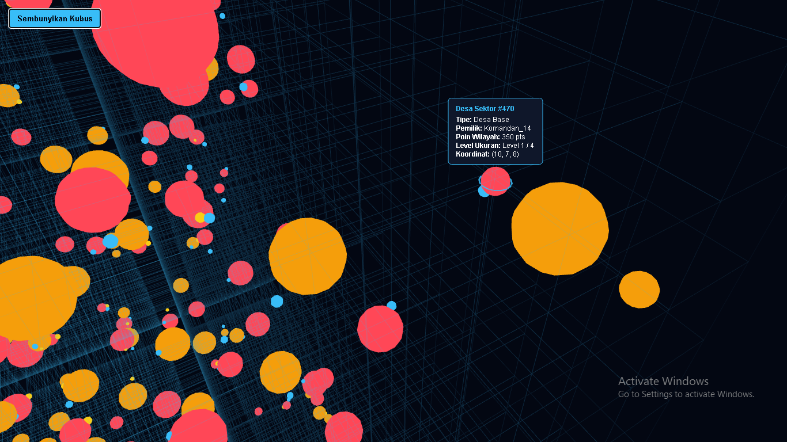

mix phx.server = ke traffic_service

lakukan ini untuk triger traffic di browser:
triggerRoute({x: -8, y: 3, z: 5}, {x: 7, y: -2, z: -9}, 35);
triggerRoute({x: 2, y: -7, z: 1}, {x: -4, y: 8, z: 3}, 42);
triggerRoute({x: 9, y: 1, z: -4}, {x: -6, y: -5, z: 8}, 38);
triggerRoute({x: -1, y: 9, z: 7}, {x: 5, y: -3, z: -2}, 50);
triggerRoute({x: 4, y: -6, z: -8}, {x: -9, y: 2, z: 4}, 47);
triggerRoute({x: -5, y: 5, z: -2}, {x: 8, y: -7, z: 6}, 31);
triggerRoute({x: 6, y: -1, z: 9}, {x: -3, y: 6, z: -5}, 55);
triggerRoute({x: -7, y: -8, z: 2}, {x: 1, y: 4, z: -7}, 40);
triggerRoute({x: 3, y: 7, z: -6}, {x: -2, y: -9, z: 1}, 60);
triggerRoute({x: -4, y: -4, z: 8}, {x: 9, y: 3, z: -3}, 33);
triggerRoute({x: 8, y: -3, z: -1}, {x: -8, y: 7, z: 5}, 48);
triggerRoute({x: -2, y: 6, z: 4}, {x: 5, y: -5, z: -8}, 36);
triggerRoute({x: 7, y: 8, z: -5}, {x: -6, y: -2, z: 9}, 52);
triggerRoute({x: -9, y: -1, z: 7}, {x: 4, y: 5, z: -4}, 45);
triggerRoute({x: 1, y: -9, z: -3}, {x: -7, y: 4, z: 8}, 39);
triggerRoute({x: 5, y: 4, z: 6}, {x: -5, y: -6, z: -7}, 58);
triggerRoute({x: -6, y: 2, z: -9}, {x: 8, y: -4, z: 2}, 41);
triggerRoute({x: 3, y: -5, z: 1}, {x: -1, y: 8, z: -6}, 34);
triggerRoute({x: -8, y: -7, z: -4}, {x: 6, y: 3, z: 5}, 49);
triggerRoute({x: 9, y: -2, z: 8}, {x: -4, y: 7, z: -1}, 44);
